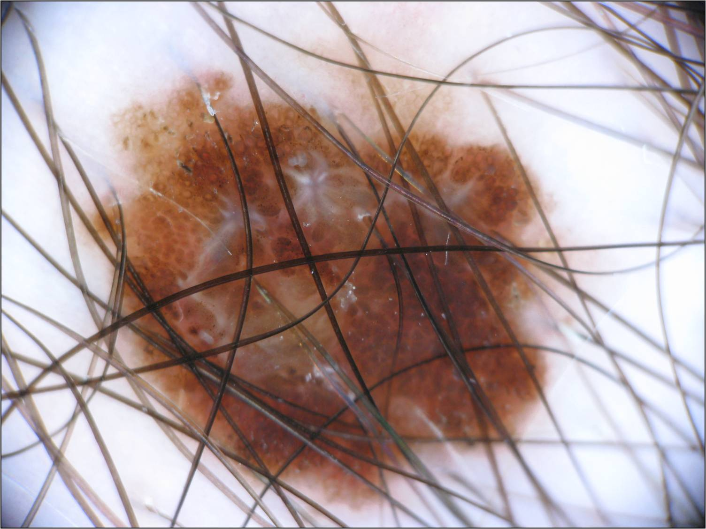
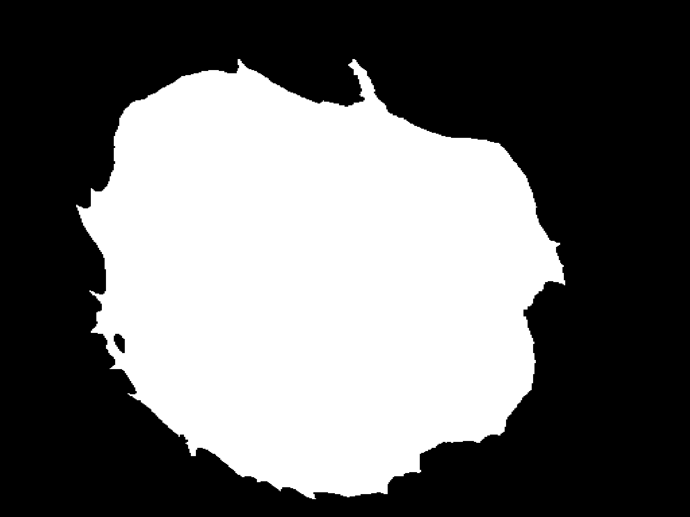
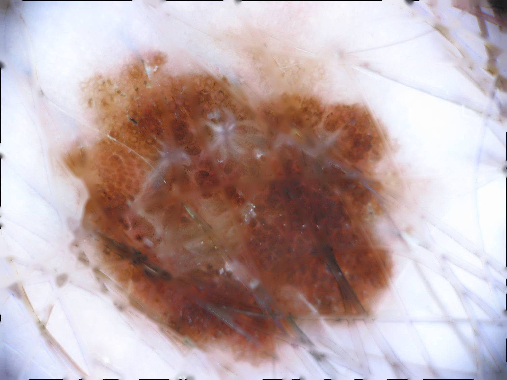
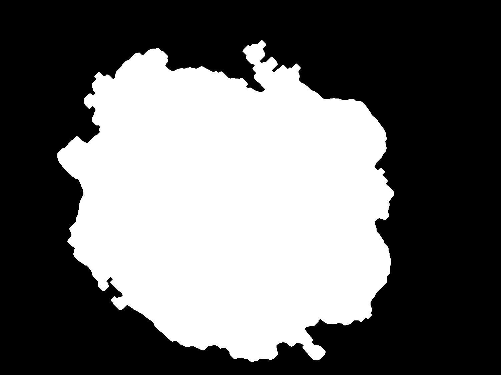
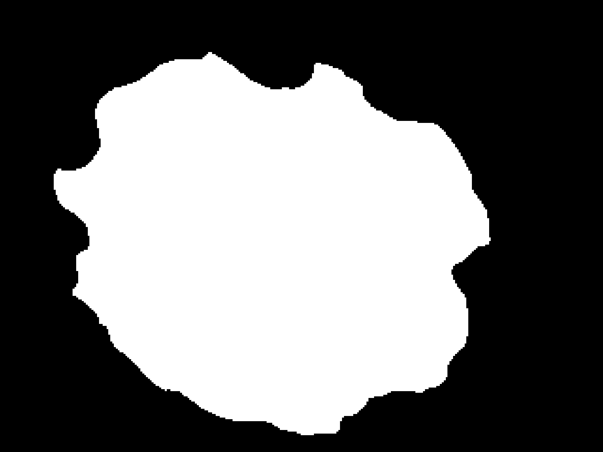

# Skin Lesion Segmentation and Classification
Advanced Image Analysis and  Deep Learning Final Project - MAIA (June 2022)

Authors: Juan Cisneros, Sofia Leon, Lluis Borras


This repository contains the code necessary to perform segmentation and classification of skin lesion images coming from the [ISIC 2017 dataset](https://challenge.isic-archive.com/data/#2017) that we developed for the courses of AIA and ML-DL courses. The full report of the work can be found [here](https://drive.google.com/file/d/18lAHqXaKnv-g3L-kwVYo-1daJ-TvYoiU/view?usp=share_link) 

The project included two different skin lesion segmentation approaches: one using classic Image Processing and another one using Deep
Learning. Additionally, two different classification methods of the skin lesions diagnosis (nevus, melanoma and seborrheic keratosis) is done with Machine Learning and Deep Learning. 


## Requirements

Create and activate a new conda environment using the provided environment definition:
```
conda env create -f environment.yaml
conda activate  AIADeep
```

Download our pre-trained weights for the U-Net (segmentation) and the ConvNext (classification) via the following commands:

<details>
<summary>
Download commands
</summary>

```
mkdir checkpoints
cd checkpoints
gdown 1IrG3V-Fc9oXTQEo2Wf0OQq_x2bPWZ_FH
gdown 1pM8GtUysfSQJOcCPIHw-kI9BbQD_FdLg
```
</details>

If you would like to reproduce the results presented, download the [ISIC 2017 dataset](https://challenge.isic-archive.com/data/#2017) in the data directory.

## Skin Lesion Segmentation 

| Original             | GroundTruth              |
| :----------------------: | :----------------------: |
| |   |

In the first segmentation method we propose the utilization of the **K-means** algorithm combined with constructed function to remove the undesirable hairs found in some images. We test our model on a 200-image subset (list of the images used as subset can be found in `data/subset-IPA-AIA.csv`) of the ISIC 2017 challenge reaching a performance of **81.34%** in the **Jaccard Index**. To process the images OpenCV was the main library used. The two main components for the effective segmentation of the lesion are the hair detection and removal algorithm and the k-means segmentation implementation with k=2 to segment background and skin lesion with FOV detection. This full pipeline for segmentation can be found in `image_processing/main.py`.

| Original             | No Hair             | K-means Segmentation               |
| :----------------------: | :----------------------: | :----------------------: |
| | |   |


In the second approach for the segmentation we build a modified **U-Net** using Pytorch framework and trained/validated it with the whole train/validation data sets of ISIC 2017 challenge, this method reached a final **Jaccard Index** of **74.91%** in the ISIC 2017 **test set**. The training was done in Google Colab pro, therefore if you would like to run the code found in `deep_learning/UNet_SoJuLlu.ipynb` as is, you will need to upload the file, the skin leasion images, the binary mask images and the UNet_Experiment_7.tar to Google Drive.

| Original             | U-Net Segmentation              |
| :----------------------: | :----------------------: |
| |   |

## Skin Lesion Classification

The diagnostic discrimination was performed for three classes of skin lesions: nevus, melanoma and seborrheic keratosis. For **Machine Learning**, skin lesion segmentation masks for the whole dataset were obtained using the U-Net and storing the results in `data/segmentation/train_UNet`, `data/segmentation/val_UNet` and `data/segmentation/test_UNet`, feature extraction is done with setting the flag_1_vs_all to 4 in `image_processing/main.py`. The features are saved in a csv in `data/feature_extraction_train.csv`, `data/feature_extraction_val.csv`, `data/feature_extraction_test.csv`, respectively. For our proposed classification algorithm, the best result was obtained by applying an **SVM classifier** to the features containing the rotation invariant LBP features without data balancing (dataset is unbalanced with way more samples of nevus skin lesions), with feature and dimensionality reduction. The **balanced accuracy** value achieved was **64.90%** (65%) on the **test set**. The code use for building the machine learning algorithm can be found in `machine_learning/Classification_ML_ROR_NDB.ipynb`. For the training of the algorithm the features of the train and validation datasets were combined, 10 fold cross validation was done. 

In the **Deep Learning** approach, we finetuned a **ConvNeXt** from the torchvision models subpackage. The whole network was finetuned without freezing any layers, with a learning rate constant at 1x10-5 for a 100 epochs. The training was done segmenting the skin lesions with the segmentations obtained from the U-Net. The **balanced accuracy** value achieved was **68.09%** on the **test set**. The training was done in Google Colab pro, therefore if you would like to run the code found in `deep_learning/ClassificationDL_SoJuLlu.ipynb` as is, you will need to upload the file, the skin leasion images,the binary mask images obtained from the U-Net, the csv files containing the groundtruth (available in the [ISIC 2017 dataset](https://challenge.isic-archive.com/data/#2017)) and the ConvNext_momentum(0)_segmented images.tar to Google Drive. 